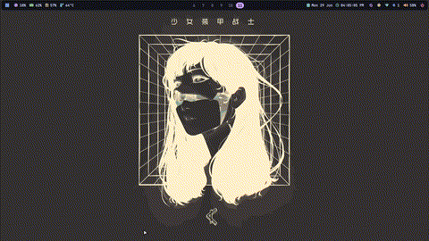

# Snappy Dock

> This isn't all good yet so try at your own risk

## Showcase (**snappy mode**)
<div align="center">
  
</div>

> there is also a boring static mode


Snappy Dock is a small dock for Hyprland.

It has two parts:

- `snappydock-d`: a C daemon that talks to Hyprland, tracks windows, loads config, and launches apps.
- `shell/`: a QuickShell/QML frontend that draws the dock, icons, dots, and menus.

The dock is meant to stay simple: quick to build, easy to configure, and easy to debug.

## Features

- Shows running Hyprland windows as dock icons.
- Supports pinned apps.
- Left-click focuses a running app or launches a pinned app.
- Right-click opens a menu for focus, launch, pin, unpin, close, float, fullscreen, and move to workspace.
- Includes a launcher button. By default it runs `fuzzel`.
- Resolves app icons from desktop files and icon themes.
- Reads an INI config file from `~/.config/snappy-dock/config.ini`.
- Config validation: invalid values are caught with a warning and replaced by safe defaults.
- Live config reload via inotify (no restart needed for most changes).
- Verbose logging (`--verbose`) for debugging.

## Requirements

Runtime:

- Hyprland
- QuickShell 0.3 or newer
- `json-c`

Build tools:

- `meson`
- `ninja`
- A C compiler such as `gcc` or `clang`
- `json-c` development headers

Package names depend on your distro. Common names are:

- Arch: `meson`, `ninja`, `json-c`, `gcc`
- Debian/Ubuntu: `meson`, `ninja-build`, `libjson-c-dev`, `build-essential`
- Fedora: `meson`, `ninja-build`, `json-c-devel`, `gcc`

## Build

From the repo root:

```sh
meson setup build
meson compile -C build
```

If `build/` already exists, only run:

```sh
meson compile -C build
```

## Install

### Using Meson

System install, usually to `/usr/local`:

```sh
sudo meson install -C build
```

This installs:

- `snappy-dock` wrapper script
- `snappydock-d` daemon
- QML shell files
- `config.ini.example`

To uninstall a Meson install:

```sh
sudo ninja uninstall -C build
```

### Manual Install (Makefile)

Alternatively, you can build and install using the provided native `Makefile`:

```sh
make
sudo make install
```

To gracefully uninstall and clean up your system afterwards:

```sh
sudo make uninstall
```

## Run

Start the installed dock:

```sh
snappy-dock
```

Restart it after installing changes:

```sh
snappy-dock --restart
```

All wrapper commands:

```sh
snappy-dock                  # Start the dock
snappy-dock --config-gui     # Open interactive settings GUI
snappy-dock --restart        # Kill + start
snappy-dock --kill           # Stop the dock
snappy-dock --status         # Check if running
snappy-dock --config         # Print config file paths
snappy-dock --verbose        # Start with info-level logging
snappy-dock --restart -V     # Restart with info logging
snappy-dock -VV              # Start with full debug logging
snappy-dock --version        # Print version
snappy-dock --help           # Show usage
```

`--verbose` / `-V` can be combined with any action like `--restart`. Repeat it (`-V -V` or `-VV`) for debug-level output.

You can also set verbosity via environment variable:

```sh
SNAPPY_DOCK_VERBOSE=1 snappy-dock          # info
SNAPPY_DOCK_VERBOSE=2 snappy-dock          # debug
```

By default (no flag), only errors and warnings are printed. This keeps stderr clean during normal use.

Run from the source tree without installing:

```sh
quickshell -p shell
```

### Auto-start with Hyprland

Add to your `hyprland.conf`:

```ini
exec-once = snappy-dock
```

## Configuration

Create your user config:

```sh
mkdir -p ~/.config/snappy-dock
cp config/config.ini.example ~/.config/snappy-dock/config.ini
```

If you are outside the source tree after installing system-wide, copy the installed example instead:

```sh
mkdir -p ~/.config/snappy-dock
cp /usr/local/share/snappy-dock/config.ini.example ~/.config/snappy-dock/config.ini
```

Edit it:

```sh
$EDITOR ~/.config/snappy-dock/config.ini
```

Restart after changing config:

```sh
snappy-dock --restart
```

You do not need to rebuild or reinstall after changing `~/.config/snappy-dock/config.ini`. A restart is enough.

You only need to reinstall after changing files in this repo, such as QML, C source, or `snappy-dock.sh`:

```sh
meson compile -C build
sudo meson install -C build
snappy-dock --restart
```

The daemon watches the config file and can send updates to the shell while running. A restart is still the clearest way to make sure every setting is applied.

See [config/config.ini.example](config/config.ini.example) for all settings and plain-language notes.

### Config validation

The daemon validates all enum-type config values on load. If you set something invalid, it warns and falls back to the default:

```
[snappydock-d] WARN:  Invalid Alignment='bottom' (expected: center, start, end), falling back to 'center'
```

Numeric values are also range-checked (e.g. `IconSize` must be 8–256, `Spread` must be 1–6).

These warnings always print regardless of `--verbose`. You do not need verbose mode to see config errors.

### `[Dock]` section

| Key | Values | Default | Notes |
| --- | --- | --- | --- |
| `Position` | `bottom`, `top`, `left`, `right` | `bottom` | Screen edge for the dock. |
| `Alignment` | `center`, `start`, `end` | `center` | Position along the edge. For top/bottom: start=left, end=right. For left/right: start=top, end=bottom. |
| `Layer` | `background`, `bottom`, `top`, `overlay` | `top` | Wayland layer-shell layer. See warning below. |
| `FullWidth` | `true`, `false` | `false` | Stretch the dock window across the full screen edge. |
| `ExclusiveZone` | `0`, `auto`, or pixel count | `0` | Reserve screen space. See warning below. |
| `AutoHide` | `true`, `false` | `false` | Hide dock when pointer leaves. See note below. |
| `HotspotDelay` | `0`–`5000` (ms) | `300` | Delay before hiding after pointer leaves. |
| `Mode` | `static`, `snappy` | `static` | `snappy` enables macOS-style magnification. |
| `Magnification` | `0.0`–`2.0` | `0.78` | Scale boost on hover (snappy only). `0.78` = 1.78x peak. |
| `Spread` | `1`–`6` | `3` | Neighbor influence radius in icon widths (snappy only). |
| `IconSpacing` | `0`+ (px) | `2` | Gap between icon cells. |
| `RiseSpacing` | `0.0`–`2.0` | `0.5` | How much magnified icons push neighbors apart (snappy only). |
| `LauncherCmd` | any command | `fuzzel` | App launcher command. |
| `LauncherPos` | `start`, `end`, `none` | `start` | Launcher button placement. `none` hides it entirely. |
| `LauncherIcon` | `dots` or any string | `dots` | `dots` renders a 9-dot grid. Any other string is rendered as a font glyph (e.g. Nerd Font symbols). |
| `LauncherIconSize` | `0`+ (px) | `0` | Custom launcher icon size. `0` = auto-scale to match `IconSize`. |
| `LauncherHoverBg` | `true`, `false` | `true` | Show background highlight on launcher hover. |
| `LauncherHoverBgSize` | `0`+ (px) | `0` | Custom hover background size. `0` = auto. |
| `IconHoverBg` | `true`, `false` | `true` | Show background highlight on dock icon hover. |
| `WorkspaceCount` | `1`–`20` | `5` | Workspaces shown in right-click "Move to workspace" menu. |

> [!IMPORTANT]
> **ExclusiveZone in snappy mode:** `ExclusiveZone=auto` does **not** work in snappy mode because the dock geometry changes dynamically during magnification. You must set a fixed pixel value (e.g. `ExclusiveZone=48`) or leave it at `0`.

> [!WARNING]
> **Layer + ExclusiveZone in snappy mode:** When using `Mode=snappy` with `ExclusiveZone`, use `Layer=overlay`. Lower layers may cause the compositor to clip magnified icons that extend beyond the reserved zone.

> [!NOTE]
> **AutoHide + ExclusiveZone:** Using both together is not recommended. The reserved space remains even when the dock is hidden, leaving a dead zone on screen. It does work, but is visually odd.

### `[Icons]` section

| Key | Values | Default | Notes |
| --- | --- | --- | --- |
| `IconSize` | `8`–`256` (px) | `48` | Base icon size. Common: 32, 40, 48, 56, 64. |
| `Theme` / `IconTheme` | theme name or empty | `""` (system) | Qt icon theme (e.g. `Tela-dracula`, `Papirus`). |
| `Fallback` / `FallbackIcon` | icon name | `application-x-executable` | Used when an app icon can't be found. |

### `[Margins]` section

Extra spacing between the dock and screen edges, in pixels.

| Key | Default |
| --- | --- |
| `Top` | `0` |
| `Bottom` | `5` |
| `Left` | `0` |
| `Right` | `0` |

### `[Font]` section

| Key | Values | Default |
| --- | --- | --- |
| `Family` | Font family name | `Sans` |
| `Weight` | `Normal`, `Bold`, `Light`, `Medium`, `SemiBold` | `Bold` |

### `[Theme]` section

Custom color overrides for the dock bar (supports hex `#RRGGBB`, `#RRGGBBAA`, `rgba(...)`, or `transparent`).

| Key | Default | Notes |
| --- | --- | --- |
| `Background` / `BgColor` | (Catppuccin Mocha) | Dock background color. |
| `BorderColor` / `DockOutline` | `rgba(1,1,1,0.08)` | Dock outline border color. |
| `BorderWidth` | `1` | Border width in pixels (0 for off). |
| `Radius` / `DockRadius` | `16` | Dock corner radius in pixels. |
| `DotActive` | `#cba6f7` | Active focused window dot indicator color. |
| `DotRunning` | `rgba(1,1,1,0.55)` | Running (unfocused) window dot indicator color. |
| `AccentColor` | `#cba6f7` | Accent color for active elements. |
| `TextColor` | `#cdd6f4` | Text color for labels and custom launcher glyphs. |
| `IconHoverBg` | `rgba(1,1,1,0.10)` | Highlight color on dock icon hover. |
| `LauncherHoverBg` | `rgba(1,1,1,0.10)` | Highlight color on launcher button hover. |
| `MenuBg` | Auto-derived / `#1E1E2EFA` | Context menu card background. |
| `MenuBorder` | `rgba(1,1,1,0.10)` | Context menu outline border. |
| `MenuHoverBg` | `rgba(1,1,1,0.08)` | Context menu item hover highlight. |
| `MenuTextColor` | Auto-derived / `#cdd6f4` | Context menu item and title text color. |
| `MenuAccent` | `#cba6f7` | Context menu active indicator bar and chevron color. |
| `MenuSeparator` | `rgba(1,1,1,0.06)` | Context menu separator line color. |

## Pinned Apps

Pinned apps are stored here:

```sh
~/.config/snappy-dock/pinned
```

The file uses one app class name per line. You normally do not need to edit it by hand. Use the right-click menu on a dock icon and choose pin or unpin.

Example:

```txt
firefox
Alacritty
code
```

If an app does not launch from a pinned icon, check that the class name matches the app desktop file or the window class shown by Hyprland.

## Controls

| Input | Action |
| --- | --- |
| Left-click running app | Focus that app |
| Left-click pinned app with no running window | Launch it |
| Right-click icon | Open the app menu |
| Right-click menu: Pin/Unpin | Add or remove the app from pinned apps |
| Right-click menu: Move to workspace | Move a window to another workspace |

## File Layout

```txt
daemon/src/               C daemon source
shell/                    QuickShell/QML frontend
config/config.ini.example Example config file
snappy-dock.sh            Installed wrapper script
meson.build               Build and install rules
Makefile                  Alternative build system
```

## Troubleshooting

### `snappy-dock: ERROR: quickshell not found in PATH`

Install QuickShell and make sure `quickshell` is available in your `PATH`.

### `snappy-dock: ERROR: snappydock-d not found in PATH`

Build and install again:

```sh
meson compile -C build
sudo meson install -C build
```

### QuickShell says `Failed to load configuration`

Run the shell directly to see the QML error:

```sh
quickshell -p shell
```

If you installed the dock, reinstall after changing QML files:

```sh
sudo meson install -C build
snappy-dock --restart
```

### Config values are being ignored

Run with `--verbose` to see what the daemon loaded:

```sh
snappy-dock --restart --verbose
```

If a config value is invalid, you will see a `WARN` line with the expected values and what it fell back to.

### Icons are missing

Make sure the app has a `.desktop` file in one of the normal application directories, such as:

```txt
~/.local/share/applications
/usr/share/applications
/usr/local/share/applications
```

Also check that your icon theme contains the icon named by the desktop file. You can set a theme in `~/.config/snappy-dock/config.ini`:

```ini
[Icons]
IconSize=48
Theme=Tela-dracula
Fallback=application-x-executable
```

Restart the dock after changing `Theme`; QuickShell reads the Qt icon theme when it starts.

### The dock does not react to Hyprland

Make sure Snappy Dock is started inside a Hyprland session. The daemon needs Hyprland IPC environment variables such as `HYPRLAND_INSTANCE_SIGNATURE`.

## Roadmap / Future TODOs

- **Refined Alignment on Floating Docks**: Continuous polishing for `Position=left`/`right` edge-anchoring with `FullWidth=false` to ensure `Alignment=start` and `Alignment=end` are completely seamless across all multi-monitor setups, aspect ratios, and scaling factors.
- **Automatic Font Weight Hierarchy**: Contextual typography (automatically bolding the active focused window while keeping context menus and passive labels at regular weight).
- **Multi-Monitor Assignment**: Per-output configuration options and independent multi-monitor dock placement.
- **FullWidth Layout Presets**: Extended layout modes when `FullWidth=true` (such as keeping launcher pinned to the screen corner while centering the running app group).
- **Dynamic ExclusiveZone with Magnification**: Investigating compositor-safe fixed bounding boxes to allow `ExclusiveZone` reservation without clipping snappy mode magnification.

## License

MIT. See [LICENSE](LICENSE).
